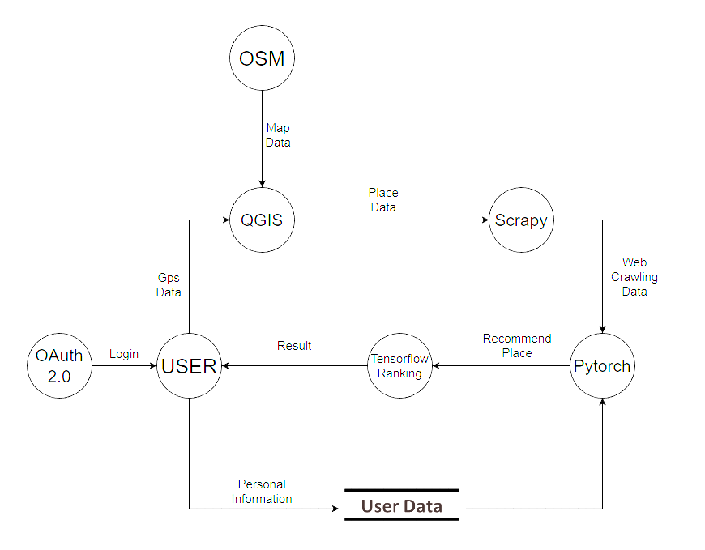

# DFD
---


---
### 개요
저희 "부기야 놀자" 서비스는 크게 3부분으로 나누어져 있습니다.
```
1. 위치 관련 정보를 얻는다.
2. 유저 정보를 얻는다.
3. 두 데이터를 이용해 결과를 사용자에게 제공한다.
```
위치 관련 정보를 얻기 위해서는 OSM, QGIS, SCRAPY를 이용합니다.
유저 정보는 서비스내 사용자가 제공하며, User Data에 저장됩니다.
마지막으로 두 데이터는 Pytorch와 Tensorflow를 이용하여 사용자에게 최종적으로 제공됩니다.

### 로그인
사용자는 서비스 이용을 위해서 우선 서비스에 로그인을 해야만 합니다. 사용자의 개인 성향 정보를 얻어오고, 추천 받은 장소등, 사용자의 개인정보가 담겨 있고, 이를 활용하기 때문에 로그인은 필수적으로 이용되어야 합니다.

쉬운 로그인과 안전한 보안을 위해서 OAuth 2.0을 이용합니다. 해당 오픈소스를 이용하면 구글, 페이스북, 깃허브 등 다양한 SNS 서비스의 계정을 이용하여 로그인을 할 수 있는 기능을 사용할 수 있습니다.
타사의 계정을 직접 타이핑해서 로그인 하는 방식이 아니기 때문에 외부로 부터 아이디가 노출되는 가능성을 차단할 수 있습니다. 또한 회원정보 뿐만아니라 기타 API에 접글 할 수 도 있기 때문에 추가적인 사용자 정보를 얻어 올 수 있는 가능성 또한 남아있습니다.

로그인 뿐만 아니라 해당 SNS의 API를 이용한다면 사용자의 검색기록, 자주 방문하는 사이트, 결제 내역등, 사용자 성향과 관련된 정보를 얻을 가능성이 있으며 이는 추천 서비스의 질을 향상시키는데 도움이 될 수 있습니다.  

### 위치 정보 처리
사용자는 서비스에게 자신 현재 위치 정보만을 제공합니다. 받은 위치 정보는 QGIS 지리 정보 체계 응용 프로그램에서 사용자 주변 장소를 탐색하기 위해서 사용됩니다.

더 정확한 지리 정보를 얻기위해서 저희 서비스에서는 OSM을 이용하였습니다. OSM내 지도 정보에는 주변 지리 정보 뿐만 아니라, 주변 건물, 관광지, 음식점, 카페, 등 다양한 위치 정보를 얻을 수 있습니다. 따라서 OSM을 이용한 자세한 Map Data를 QGIS에게 전달합니다.

QGIS는 OSM내의 지도 정보와 사용자의 위치 정보를 이용하여 사용자 주변의 모든 Place Data를 만들어 냅니다. 그리고 해당 데이터를 Scrapy에게 전달합니다.

Scarpy는 QGIS로부터 전달 받은 Place Data를 이용하여 웹에서 해당 데이터와 연관된 모든 데이터들을 크롤링합니다. Scrapy를 이용하여 얻을 수 있는 정보들은 해당 장소의 리뷰, 평점, 이미지, 게시물 수, 등 다양한 정보들을 수집합니다. 그 후 Scrapy를 통해 얻은 Web crawling Data는 Pytorch 머신러닝에게 전달됩니다.

제공되는 Web crawling Data내의 각각의 액티비티들은 자세한 정보들을 담고 있습니다. 위치, 사용자의 위치로부터의 거리, 이동 시간, 해당 액티비티내 결제와 관련된 정보,등 자세한 정보들이 제공됩니다. 

### 유저 정보 처리
사용자는 머신 러닝 기능을 수월하게 이용하기 위해서는 서비스에게 자신의 정보를 제공해야 합니다. 

사용자가 서비스에게 제공할 수 있는 데이터에는 자신의 성향, 성별, 나이, 가보았던 장소, 선호하는 음식과 장소, 장소를 방문할 시간, 좋아하는 활동 등이 있습니다. 사용자가 더 자세하고 더 많은 정보를 제공 할수록 서비스가 제공하는 추천 서비스의 질이 향상되며 만족스러운 서비스를 제공할 수 있게됩니다.

또한 추천 받은 서비스에 대한 사용자의 평가도 User Data에 수집되어 이후의 평가들에 반영이 됩니다.

User Data는 Pytorch 머신러닝에서만 참조가 가능합니다.

### 액티비티 추천 처리
액티비티 추천과정에서는 Pytorch와 Tensorflow Ranking 모듈이 사용됩니다.

우선 Pytorch에서는 Scrapy가 제공한 Web crawling Data와 User Data가 이용됩니다. User Data으로부터 얻은 사용자 성향을 바탕으로 Web crawling Data에서 사용자가 선호할만한 데이터들로만 필터링하여 걸러냅니다. 그리고 사용자 성향과 비슷한 유저들이 이용한 액티비티들을 수집합니다. 이를 통해 Pytorch는 사용자의 성향에 맞는 데이터들을 수집할 수 있게됩니다. 그 후 이러한 Recommend Place Data는 Tensorflow Ranking module에게 제공됩니다.

Tensorflow Ranking 모듈은 Pytorch를 통해 얻은 Recommend Place Data를 순위별로 정렬하기 위한 기능을 담당합니다. 순위별로 정렬하는 기준으로는 해당 액티비티의 리뷰수, 리뷰 내용, 별점, 사용자의 성향과의 연관성 등 다양한 요소들을 분석하며 각각의 요소들에 대해 점수를 배정합니다. 모든 분석이 끝난 후 점수가 높은 순으로 정렬이 됩니다. 최종적으로 정리된 결과는 사용자에게 제공됩니다. 

사용자가 특정 액티비티에 대해 방문할 것을 예정한다면, 서비스는 해당 방문 이후 추가적으로 방문하면 좋은 액티비티를 추천합니다. 따라서 자연스럽게 사용자는 오늘 하루의 방문할 액티비티 코스를 만들어 낼 수 있게 됩니다.

사용자가 해당 추천에 대해서 리뷰를 남길 수 있습니다. 추천에 대해 만족하거나 불만족한 점을 점수 형태로 서비스에게 제공하여 User Data에 반영할 수 있습니다. 이는 이후의 더 정확한 추천 서비스를 위해 사용되게 됩니다. 